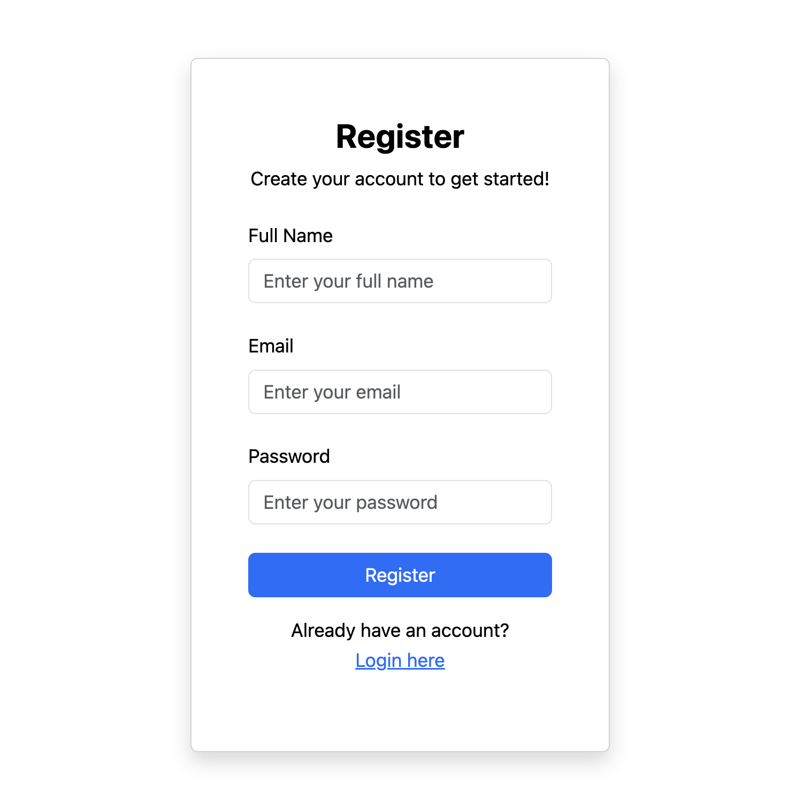
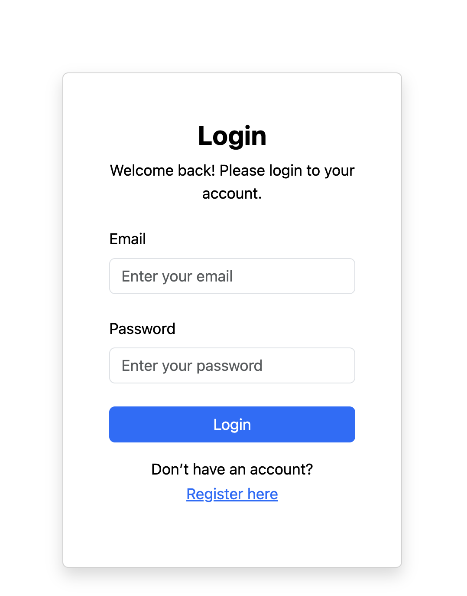

# Project Title: Countries App

Countries App is a React-based web application that provides comprehensive information about countries around the world. This interactive app fetches and displays country data, including flags, names, languages, real-time weather information and news from various APIs.

It is part of React Advanced course at `'Business College of Helsinki'` Full Stack Web Development programme, `'React24k'`.

## Key Features

### Country Information:

 **Displays detailed information about countries, including:**

  * National flag

  * Country name

  * Official language(s)

  * Current weather conditions

 ### API Integration:

  **Fetches data from multiple sources:**

 * Country data API for flags, names, and languages

 * Weather API for real-time weather information

 * News API for latest country-specific news

### Favourites Management:

 * Add countries to a favourites list

 * Remove countries from favourites

 * Persistent storage of favourites using Firebase

### Single Country View:
**Dedicated page for each country, showcasing:**

 - Large display of the country's flag

 - Detailed weather information

 - Recent news articles related to the country

### Firebase Integration:
**Utilizes Firebase as the backend database for storing and managing user favourites**

## How It Works:

1. Register:

2. Login:

 - Technical Highlights

Currently, two official plugins are available:

