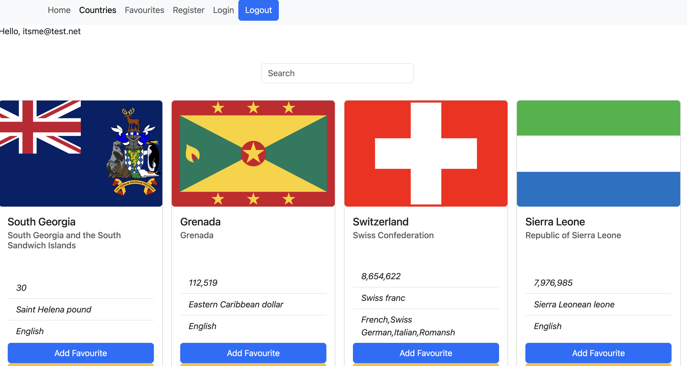
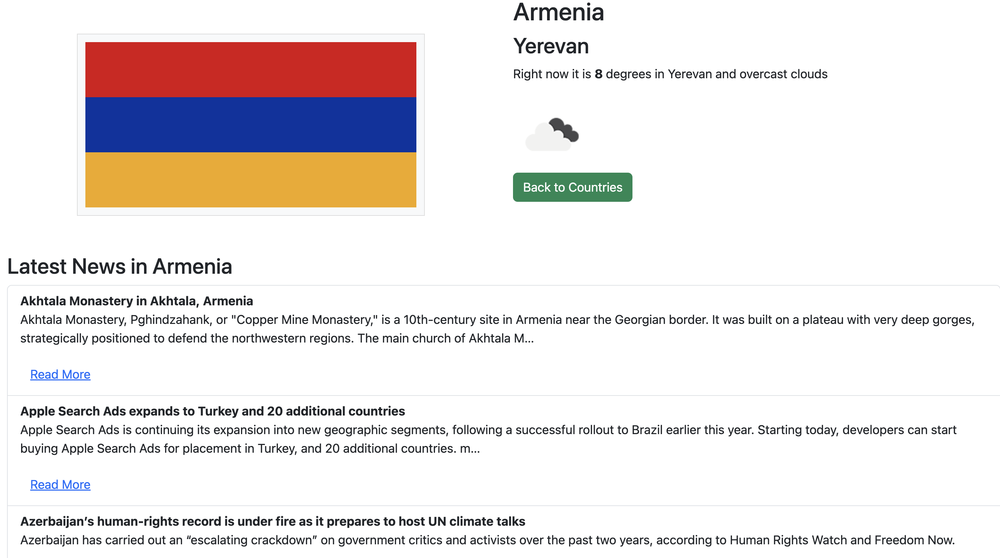

# Project Title: Countries App

Countries App is a React-based web application that provides comprehensive information about countries around the world. This interactive app fetches and displays country data, including flags, names, languages, real-time weather information and news from various APIs.

It is part of React Advanced course at `'Business College of Helsinki'` Full Stack Web Development programme, `'React24k'`.


## Key Features

### Country Information:

 **Displays detailed information about countries, including:**

  * National flag

  * Country name

  * Official language(s)

  * Current weather conditions

 ### API Integration:

  **Fetches data from multiple sources:**

 * Country data API for flags, names, and languages

 * Weather API for real-time weather information

 * News API for latest country-specific news

### Favourites Management:

 * Add countries to a favourites list

 * Remove countries from favourites

 * Persistent storage of favourites using Firebase

### Single Country View:
**Dedicated page for each country, showcasing:**

 - Large display of the country's flag

 - Detailed weather information

 - Recent news articles related to the country

### Firebase Integration:
**Utilizes Firebase as the backend database for storing and managing user favourites**

## How It Works:

1. Register:

To register: name, email and passwords are needed.


2. Login:

Once registered, the provided data are stored in firebase and then the user can login to the app:


3. How the app looks:

The App has a list of countries and their flag, weather, currencies used, population and so on.



4. Single page

The single page contains some cool features. It also include news feed from the specific country and the news are made limited to ten to avoid a huge list of news catalog.




## Technologies used:

**Core Technologies**

* React

* Vite

**State Management and Routing**

* Redux Toolkit

* React Redux

* React Router DOM

**UI Framework**

* React Bootstrap

* Bootstrap

* Bootstrap Icons

**API and Data Fetching**

* Axios

**Firebase Integration**

* Firebase

* React Firebase Hooks


## Installation

To get started with this project, follow these steps:

1. Clone the repository:

```bash
git clone https://github.com/nahusenayElias/Countries_API
```

2. Navigate to the project directory: In our case to...

```bash
cd Countries_API
```

3. Install dependencies:

```bash
npm install
```

4. Start development server:

```bash
npm run dev
```

### License

This project is licensed under the MIT License.

